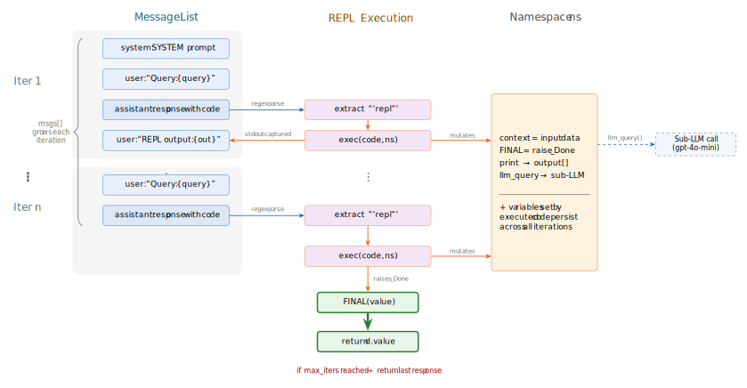

# Building a Recursive Language Model in 77 Lines

*PySprings talk — from intuition to working code.*

[](docs/assets/rlm-loop.svg)

## The idea

LLMs get worse as you give them more context — attention dilutes, signal degrades. The [RLM paper](https://arxiv.org/abs/2512.24601) (Zhang, Kraska, Khattab — MIT 2025) beat vanilla GPT-5 on long-context benchmarks with a different approach: **don't put the document in the prompt. Store it as a Python variable and let the LLM write code to explore it.**

The LLM runs a research session in a Python REPL — slicing text, running regex, calling a cheaper sub-model on chunks — until it has an answer. The irreducible core is about 30 lines of logic. This repo implements it in 77.

## Demo

Run the demo against any Project Gutenberg book, a URL, or a local file:

```
uv run python code/demo.py 35          # The Time Machine (~1 min)
uv run python code/demo.py 84          # Frankenstein
uv run python code/demo.py path/to/book.txt
```

Books are cached under `data/` after the first download. Requires an `OPENAI_API_KEY` in the environment.

## Use the library

```python
from rlm import rlm

answer = rlm("What's the main argument?", context=huge_document)
```

## Slides

The talk is a [literate programming](https://en.wikipedia.org/wiki/Literate_programming) document — `code/rlm.py` and `code/demo.py` are tangled from the markdown slides in `docs/`.

View locally:

```
uv sync --all-extras --dev
make docs/build
make docs/serve        # opens on localhost:8000
```

Rebuild code from markdown:

```
make build
```

## Structure

```
docs/           markdown slides (source of truth)
code/           tangled Python source
docs/assets/    diagrams (SVG + PNG)
diagrams/       TikZ diagram sources
```

## Credits

Based on [Recursive Language Models](https://arxiv.org/abs/2512.24601) by Alex Zhang, Tim Kraska, and Omar Khattab (MIT, 2025).  
Official repo: [alexzhang13/rlm](https://github.com/alexzhang13/rlm) · Minimal repo: [alexzhang13/rlm-minimal](https://github.com/alexzhang13/rlm-minimal)

## License

MIT — see [LICENSE](LICENSE).
