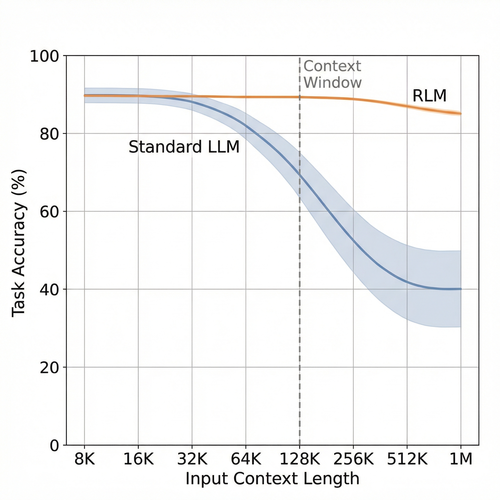

## The problem: LLMs get dumber as you give them more

You've probably noticed this. You paste a huge document into ChatGPT and ask a question about it. Short documents? Great answers. But as the document gets longer, the answers get worse — vaguer, more wrong, sometimes completely hallucinated. Researchers call this **context rot**.

It's not a bug, exactly. It's a limitation of how transformers work. The signal-to-noise ratio degrades as the haystack grows.

The obvious human intuition is: *don't read the whole thing at once — skim it, break it into pieces, read the pieces carefully, then combine what you found.* That's what a Recursive Language Model does, except the LLM does the skimming, breaking, and combining by writing Python.

## The core idea in one sentence

**Instead of stuffing a huge document into the LLM's prompt, store it as a Python variable and let the LLM write code to explore it.**

The document lives in a Python REPL. The LLM writes little scripts — slice the text, search with regex, feed chunks to sub-LLMs — and reads the printed output. It iterates until it has an answer. From the outside:

~~~python
answer = rlm("What's the main argument?", context=huge_document)
~~~

From the inside, the LLM is running a research session in a Python notebook.
