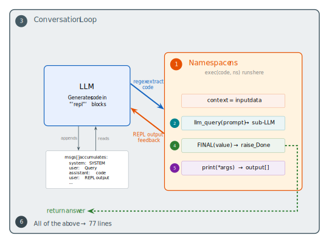
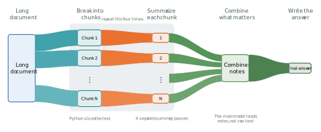

## Let's build it

Here's the whole machine. Six pieces, each simple on its own:

And here's the document-level picture we want the code to create:

The main model never has to read the whole document at once. It breaks the text into chunks, analyzes each chunk separately, then combines the short summaries.

We'll walk through each numbered piece, then assemble them into 77 lines.

- [Step 1: The REPL is just a dictionary](03-01-step-1-repl.md) — the namespace
- [Step 2: Give the LLM a sub-LLM](03-02-step-2-sub-llm.md) — `llm_query`
- [Step 3: The conversation loop](03-03-step-3-loop.md) — the outer frame
- [Step 4: Knowing when to stop](03-04-step-4-final.md) — `FINAL` as an exception
- [Step 5: Capturing print output](03-05-step-5-print.md) — shadowing `print`
- [Step 6: Putting it together](03-06-step-6-together.md) — all of the above
